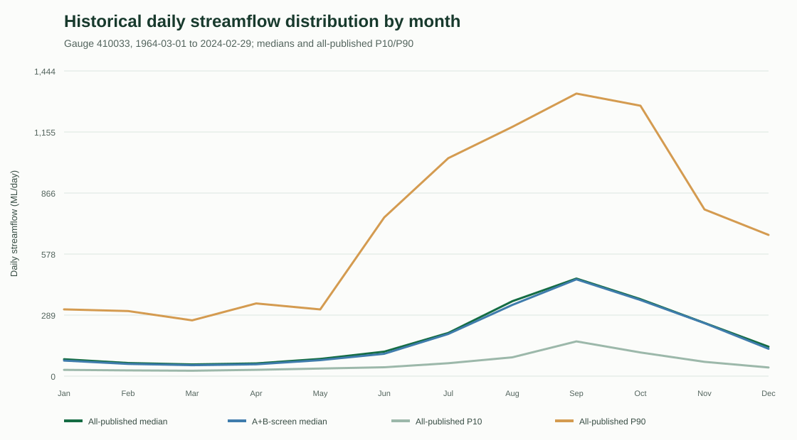
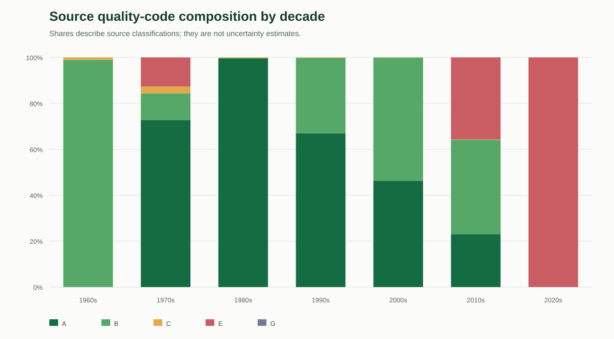
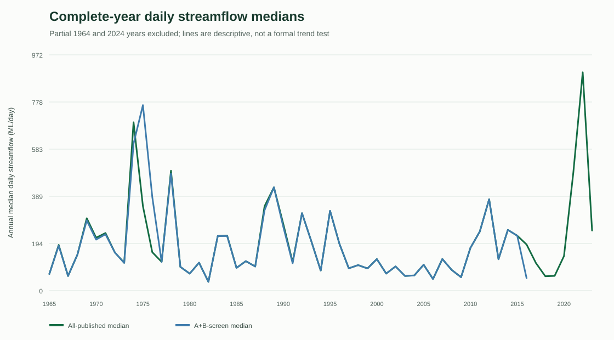

# Mittagang 410033 Historical Daily Streamflow Characterisation v0.1

## Bounded answer

For the declared gauge record and method, 21,915 daily values cover every calendar date from 1964-03-01 to 2024-02-29. The all-published daily median is 148.956 ML/day and the central 80% spans 37.325 to 802.422 ML/day. Monthly and annual distributions vary substantially. These are historical descriptive indicators, not a statement of current conditions.

**State:** `S0 BASELINE_MONITORING / L2 DESCRIPTIVE_INDICATOR`  
**Evidence cut-off:** `2024-02-29`  
**Current-condition conclusion:** `NOT SUPPORTED`

## Dataset and grain

- Publisher: Australian Bureau of Meteorology, Hydrologic Reference Stations.
- Gauge: 410033, Murrumbidgee River at Mittagang Crossing.
- Grain: one source-local daily streamflow value, `ML/day`.
- Coverage: `1964-03-01` to
  `2024-02-29`.
- Rows: `21,915`; missing dates:
  `0`; blank values:
  `0`; duplicate dates:
  `0`.
- Exact source digest: `sha256:12740d6edc884b3f7a960935215cdff1bdbe5bd85c9c9a96d3aa219272d31534`.

## Quality treatment

The primary description retains every source-published value and keeps its
quality code visible. A separate A+B-only sensitivity screen is reported; it
does not silently replace the official series.

| Code | Source meaning | Count | Share |
|---|---|---:|---:|
| A | Best available data | 11,280 | 51.5% |
| B | Good data | 7,192 | 32.8% |
| C | Poor data | 156 | 0.7% |
| E | Unreliable data | 3,287 | 15.0% |
| G | Gap filled data | 0 | 0.0% |

The source header also states that data gaps were filled with a daily
rainfall-runoff model, while the published rows contain no `G` code. This
apparent tension is preserved as a method limitation and requires hydrology
review; ClimateOS does not relabel rows.

## Overall distribution

| Method | Count | P10 | Median | P90 | Maximum |
|---|---:|---:|---:|---:|---:|
| All published | 21,915 | 37.325 | 148.956 | 802.422 | 38,352.186 |
| A+B screen | 18,472 | 36.029 | 142.087 | 707.575 | 25,583.446 |

The A+B-screened median differs from the all-published median by
`-4.61%`. This is method
sensitivity, not an estimate of measurement error.

## Monthly distribution

| Month | All median | A+B median | All P10 | All P90 |
|---|---:|---:|---:|---:|
| Jan | 80.008 | 73.528 | 29.722 | 315.927 |
| Feb | 62.036 | 57.803 | 27.216 | 307.952 |
| Mar | 55.340 | 51.754 | 25.575 | 263.956 |
| Apr | 60.179 | 55.988 | 29.878 | 343.998 |
| May | 81.476 | 75.601 | 35.934 | 315.650 |
| Jun | 115.864 | 105.928 | 41.965 | 751.269 |
| Jul | 204.469 | 199.630 | 61.077 | 1,031.598 |
| Aug | 354.632 | 337.052 | 89.054 | 1,179.681 |
| Sep | 461.772 | 457.970 | 164.361 | 1,337.148 |
| Oct | 364.222 | 360.078 | 111.924 | 1,279.673 |
| Nov | 251.685 | 250.737 | 67.644 | 788.738 |
| Dec | 139.236 | 129.429 | 40.946 | 668.296 |

All values are `ML/day`.





## Annual and trend boundary

Annual distributions are published for all years, but cross-year comparison
uses only complete calendar years. The partial 1964 and 2024 years remain in
the daily and monthly record but are not treated as complete annual periods.



No formal trend or change-point result is issued in v0.1. Source quality
composition changes materially through time; a later method must address
quality, serial dependence, seasonality and multiple testing before trend
language is permitted.

## What this establishes

- a reproducible historical distribution for this admitted gauge record;
- calendar coverage and source quality composition;
- monthly, seasonal, complete-year and decadal descriptive summaries;
- sensitivity to an explicit A+B quality screen.

## What this does not establish

- current 2026 flow;
- Cooma drinking-water sufficiency or safety;
- storage, extraction, demand or water balance;
- causes of historical variation;
- engineering, wastewater or public-safety status;
- catchment-wide behaviour.

## Human review and retrospective plan

Founder evidence review is the current gate. A qualified hydrology review is
required before any L3 promotion or formal trend method. If the source or
method changes, ClimateOS must preserve this version, rerun from exact admitted
bytes, compare output digests and indicators, and explain the differences.

## Output identity

```json
{
  "characterisation_receipt.json": "sha256:ff7199b11a81ce12837b6120b89e8df287524e8bed772b9c742b3d3799f5e836",
  "time_bounded_environmental_answer.json": "sha256:544d356a2e3ad61fd38bcb97482ac0b305c0362562556f329e6394af82f563ed",
  "evidence_passport.json": "sha256:4e1034f50a4f9abc1207c201f6784252903ab79f2fa218358793b99a513d03f1",
  "monthly_profile.csv": "sha256:fb0aade49d54970169b1a3a5fd4859e02d546dff8b16504ec9a1352b7c02d876",
  "annual_complete_year_profile.csv": "sha256:e92d1e64402e177d03ea4807836c84f2760d09ccb34372a0e418fed94d88aa8c",
  "monthly_distribution.svg": "sha256:623ed80f97d355d2931ada0952783620ee37c0732af04b664c1affb8f003157e",
  "annual_medians.svg": "sha256:31fdbde2bcd6d8e33eaf8296f129663ea4c9f975ba917669ccc9a8a65d86c8cf",
  "quality_composition_by_decade.svg": "sha256:a759138dc4186df72dfe39ee4a0b92338b4f2480db182e7db9369bf9a22f7392"
}
```
