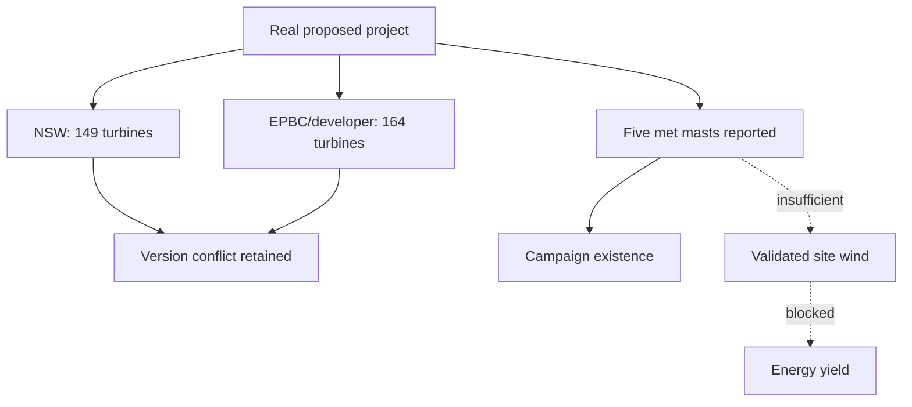

# ClimateOS Task1631–1640 — Bondo Wind Evidence Passport, Claim Graph and Scientific Review Dry Run Formal Brief

Date: 2026-07-15  
Status: FOUNDER_AUTHORIZED / DOCUMENTATION_ONLY / NO_WIND_RESOURCE_CONCLUSION  
Repository: `simon947161/eco-agent-system`  
Branch: `agent/task1631-1640-bondo-evidence-passport-claim-graph`  
Base merge commit: `e1bbd566483ba0a416758f639479ca3d4f27b09d`

## 1. Authorization and inherited controls

The controlled nightly batch merged PR #66 at `e1bbd566483ba0a416758f639479ca3d4f27b09d` and activated only the Task1631–1640 candidate gate recorded in Task1630.

This batch is a documentation and governance dry run. It does not authorize:

- new meteorological, GIS, model or attachment acquisition;
- sending the prepared Neoen or NSW Planning inquiries;
- contacting or appointing Dr Zhang Lu, Professor Chen Shiping or another reviewer;
- account, quote, payment, FTP, cloud-object, live-API or paid access;
- wind-resource, hub-height, energy-yield, planning, safety, investment or viability conclusions.

GraphCast remains `LATER`. Constellation Journey remains excluded.

## 2. Purpose

Task1631–1640 converts the admitted Bondo public evidence into a non-operational Evidence Passport shell and claim graph so that:

- facts, proponent statements, derived metadata and gaps are visibly different;
- source and layout versions are not silently collapsed;
- unsupported conclusions fail before calculation;
- future human review has a bounded evidence and authority surface.

## 3. Task map

| Task | Deliverable/result |
|---|---|
| 1631 | Merge lineage, scope and project-isolation lock |
| 1632 | Evidence Passport identity and subject boundary |
| 1633 | Public source/evidence-object registry |
| 1634 | Claim-node and relation vocabulary |
| 1635 | 149/164 turbine and layout-version contradiction nodes |
| 1636 | Five-met-mast campaign evidence nodes and limits |
| 1637 | Reviewer-role and authority routing |
| 1638 | Fictional scientific-review dry run |
| 1639 | Founder-facing decision and rejection view |
| 1640 | Closure and next-gate decision |

## 4. Passport subject boundary

Passport ID: `CLIMATEOS-AU-NSW-BONDO-WIND-EP-0001`  
Subject: proposed Bondo Wind Farm public wind-evidence state  
Project IDs: NSW `SSD-86276211`; EPBC `2026/10465`  
Spatial level: project/investigation-area evidence; no turbine-site truth  
Temporal cut-off: public materials admitted through 2026-07-15  
Operational status: non-operational documentation object  
Scientific conclusion status: blocked

The passport does not contain raw wind measurements, a legal boundary, an approved final layout or a bankable resource assessment.

## 5. Evidence classes

| Class | Meaning | Example |
|---|---|---|
| `OFFICIAL_PORTAL_FACT` | displayed by a government project record | NSW stage and application ID |
| `PROPONENT_DATED_STATEMENT` | public proponent statement tied to a document/date | five met masts installed by November 2025 booklet |
| `PROPONENT_PRELIMINARY_MAP` | visual project communication, not final GIS | 2025 preliminary turbine map |
| `DERIVED_METADATA` | careful transformation of admitted source metadata | 149/164 retained as version conflict |
| `MISSING_EVIDENCE` | required field not publicly found | mast heights, QC and uncertainty |
| `PROHIBITED_INFERENCE` | conclusion not supported by admitted evidence | bankable wind resource or capacity factor |

## 6. Relation vocabulary

- `SUPPORTS_IDENTITY`: supports that an object/project/campaign exists;
- `SUPPORTS_DATED_STATEMENT`: supports only the attributed statement at its source date;
- `VERSION_DIFFERS_FROM`: records coexistence without declaring one false;
- `DOES_NOT_SUPPORT`: prevents evidence promotion to a stronger claim;
- `REQUIRES_EVIDENCE`: links a claim to missing material;
- `REQUIRES_REVIEW`: links a claim to a bounded human role;
- `SUPERSEDED_BY`: may be used only when a controlling later source explicitly supersedes an earlier version.

No confidence score may erase source class, version conflict or missing evidence.

## 7. Claim graph overview

The dotted route is a failed inference path, not a calculation chain.

## 8. Review authority separation

| Question | Required role | Present state |
|---|---|---|
| Does the public source say five masts existed? | evidence/provenance review | dry-run answer possible |
| Are mast data scientifically fit? | wind/atmospheric scientist | blocked; data/method absent |
| Is the geometry authoritative/current? | GIS/planning record specialist | blocked; machine-readable official geometry absent |
| Are retention/reuse rights sufficient? | data-governance/licence review | unresolved |
| Is a project-performance conclusion justified? | accountable multi-disciplinary review | prohibited at this stage |

## 9. Decision

`EVIDENCE_PASSPORT_SHELL_READY / CLAIM_GRAPH_READY / UNSUPPORTED_WIND_CONCLUSIONS_REJECTED`

## 10. Hard stop

Do not merge the resulting Draft PR, operationalize the passport, contact reviewers, send inquiries, acquire raw data or begin Task1641+ without the next controlled preflight.

