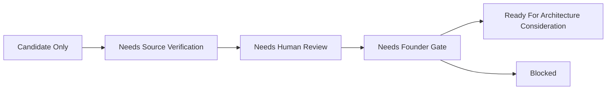

# Evidence Readiness Workflow Concept

This document is part of the Task361-420 ClimateOS MVP Architecture v0.1 and Prototype Planning Sprint. It is architecture documentation and prototype planning only. It does not authorize or create runtime, implementation, API, database, MCP, automation, scoring, compliance, assurance, certification, ESG/carbon conclusions, standards interpretation, framework interpretation, operational Evidence Passport, deployment, or Task421.

## Purpose

Evidence Readiness expresses non-scoring review state.

## Allowed Labels

- Not ready.
- Candidate only.
- Needs source verification.
- Needs human review.
- Needs Founder Gate.
- Ready for architecture consideration.
- Blocked.

## Conceptual Workflow

## Boundary

Readiness is not a score, ranking, assurance level, certification status, or compliance state.
