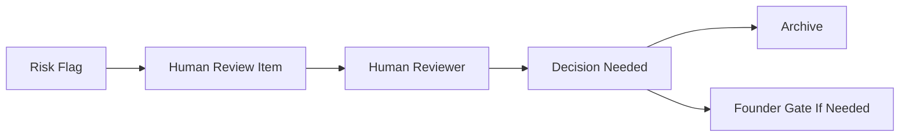

# Human Review Queue Concept

This document is part of the Task361-420 ClimateOS MVP Architecture v0.1 and Prototype Planning Sprint. It is architecture documentation and prototype planning only. It does not authorize or create runtime, implementation, API, database, MCP, automation, scoring, compliance, assurance, certification, ESG/carbon conclusions, standards interpretation, framework interpretation, operational Evidence Passport, deployment, or Task421.

## Purpose

The Human Review Queue Concept organizes review needs so they can be seen, archived, and resolved by humans in a future authorized workflow.

## Review Item Information

- Queue item type.
- Reason for review.
- Linked source.
- Linked claim.
- Linked Knowledge Object.
- Linked evidence candidate.
- Risk flag.
- Reviewer note.
- Decision needed.
- Stop condition.
- Archive requirement.

## Conceptual Routing

## Boundary

No queue is implemented. No review is automated.
