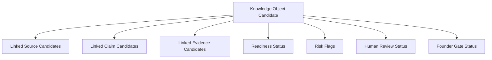

# Knowledge Object Registry Concept

This document is part of the Task361-420 ClimateOS MVP Architecture v0.1 and Prototype Planning Sprint. It is architecture documentation and prototype planning only. It does not authorize or create runtime, implementation, API, database, MCP, automation, scoring, compliance, assurance, certification, ESG/carbon conclusions, standards interpretation, framework interpretation, operational Evidence Passport, deployment, or Task421.

## Purpose

The Knowledge Object Registry Concept organizes candidate relationships for future review.

## Conceptual Fields

- KO ID.
- KO type.
- Linked source candidates.
- Linked signal candidates.
- Linked claim candidates.
- Linked evidence candidates.
- Readiness status.
- Risk flags.
- Human Review status.
- Founder Gate status.
- Archive status.
- Stop point.

## Boundary

This is not a database schema, data model implementation, registry runtime, or storage design.

## Relationship Concept

