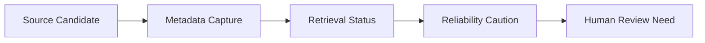

# Source Intake Layer Concept

This document is part of the Task361-420 ClimateOS MVP Architecture v0.1 and Prototype Planning Sprint. It is architecture documentation and prototype planning only. It does not authorize or create runtime, implementation, API, database, MCP, automation, scoring, compliance, assurance, certification, ESG/carbon conclusions, standards interpretation, framework interpretation, operational Evidence Passport, deployment, or Task421.

## Purpose

Source Intake captures source candidate metadata requirements for future review.

## Required Information

- Source ID.
- Title.
- Publisher / institution.
- Date.
- URL / citation path.
- Access date.
- Source type.
- Language.
- Translation note.
- Reliability caution.
- Version / update status.
- Attachment support requirement.
- Public / private source distinction.
- Retrieval status.

## Conceptual Flow

## Boundary

Source Intake does not fetch, verify, score, certify, assure, or admit evidence.
