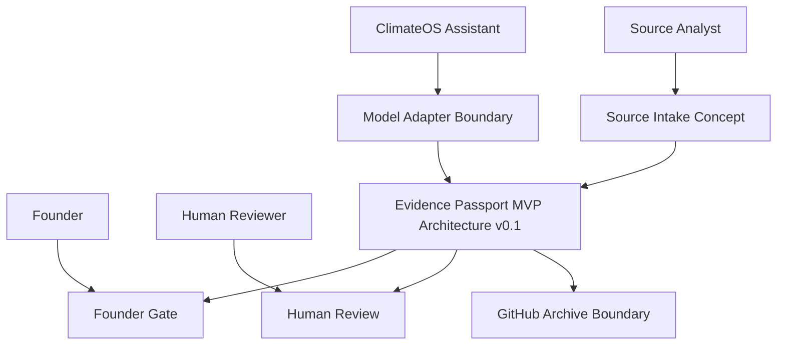
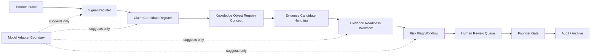
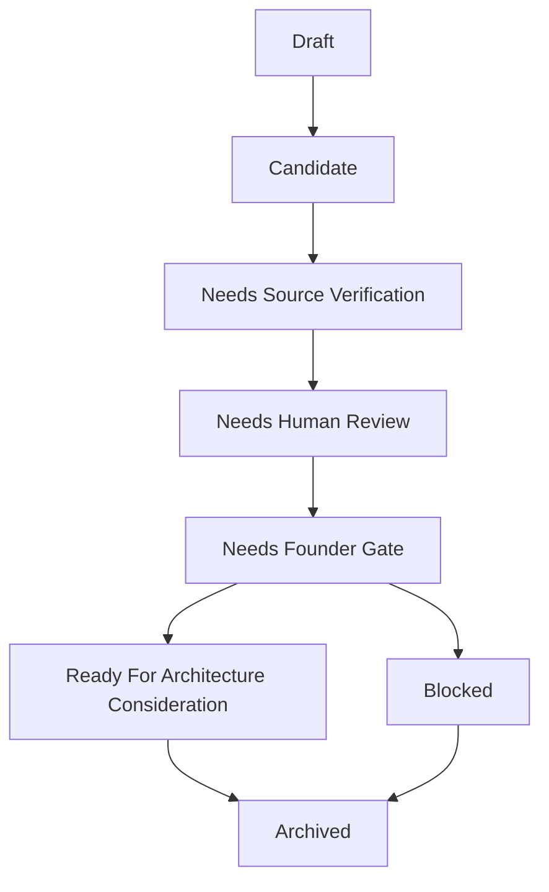
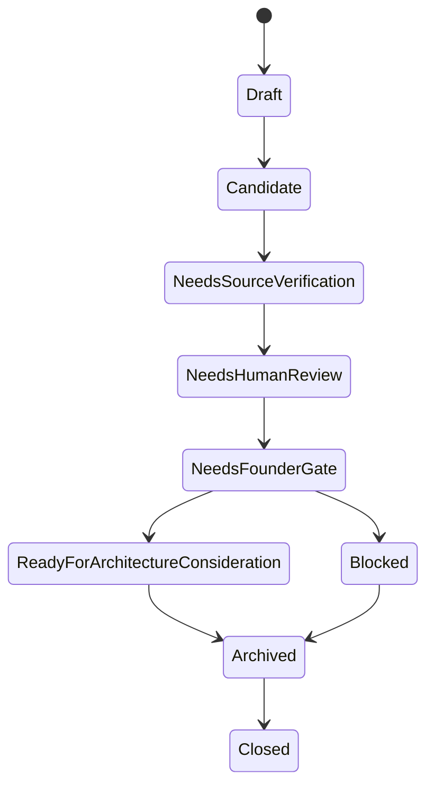

# Task381-390 Architecture v0.1 Package

This document is part of the Task361-420 ClimateOS MVP Architecture v0.1 and Prototype Planning Sprint. It is architecture documentation and prototype planning only. It does not authorize or create runtime, implementation, API, database, MCP, automation, scoring, compliance, assurance, certification, ESG/carbon conclusions, standards interpretation, framework interpretation, operational Evidence Passport, deployment, or Task421.

## Task381 System Context Diagram

This is a conceptual context diagram only.

## Task382 Component Boundary Diagram

Component boundaries are documented in [COMPONENT_BOUNDARY_REGISTER.md](COMPONENT_BOUNDARY_REGISTER.md).

## Task383 Workflow Diagram

Workflow states are conceptual and are not a state machine.

## Task384 Review State Diagram

This diagram is a planning artifact only.

## Task385 Human Authority Model

Human Authority is the responsibility layer that prevents candidate records, model suggestions, risk flags, and readiness labels from becoming automated conclusions.

Detailed model: [HUMAN_AUTHORITY_MODEL.md](HUMAN_AUTHORITY_MODEL.md).

## Task386 Founder Gate Model

Founder Gate controls:

- Future architecture escalation.
- Public / partner use.
- Conclusion-risk escalation.
- Operational Evidence Passport proposals.
- Automatic continuation prevention.

Detailed model: [FOUNDER_GATE_MODEL.md](FOUNDER_GATE_MODEL.md).

## Task387 Model Adapter Boundary

Model Adapter may support:

- Summarization suggestions.
- Claim candidate extraction suggestions.
- Signal clustering suggestions.
- Risk flag suggestions.
- Readiness label suggestions.
- Review note drafts.

Model Adapter must not decide, approve, score, certify, assure, interpret standards, interpret frameworks, or replace human review.

Detailed boundary: [MODEL_ADAPTER_BOUNDARY.md](MODEL_ADAPTER_BOUNDARY.md).

## Task388 GitHub Archive Boundary

GitHub Archive preserves documentation trail only.

It must not create automation, deployment, runtime hooks, external publication, or operational Evidence Passport.

Detailed boundary: [GITHUB_ARCHIVE_BOUNDARY.md](GITHUB_ARCHIVE_BOUNDARY.md).

## Task389 Non-Automation Boundary

Non-automation controls are maintained in [NON_AUTOMATION_AND_STOP_CONDITIONS.md](NON_AUTOMATION_AND_STOP_CONDITIONS.md).

## Task390 Architecture v0.1 Summary

Architecture v0.1 defines a conceptual structure:

- Source Intake.
- Signal Register.
- Claim Candidate Register.
- Knowledge Object Registry Concept.
- Evidence Candidate Handling.
- Evidence Readiness Workflow.
- Risk Flag Workflow.
- Human Review Queue.
- Founder Gate.
- Audit / Archive.
- Model Adapter Boundary.

No runtime, implementation, API, database, MCP, n8n, QCloud, automation, scoring, deployment, or operational Evidence Passport was created.
